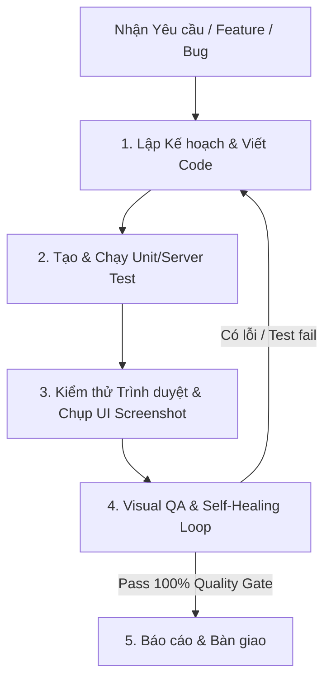

# Autonomous Pipeline & Multi-Agent Orchestration Guide

Dự án **Kotodama** (Đồ án tốt nghiệp VKU) áp dụng quy trình phát triển và kiểm thử tự động khép kín (Autonomous Pipeline) với sự điều phối của **Tech Lead (Antigravity)** kết hợp các mô hình chuyên biệt từ **OpenCode Go**.

---

## 1. Phân bổ Mô hình & Vai trò (Model Roles)

| Vai trò                         | Provider & Model                                   | Trách nhiệm chính                                                                                                                                                 |
| ------------------------------- | -------------------------------------------------- | ----------------------------------------------------------------------------------------------------------------------------------------------------------------- |
| **Tech Lead & Lead Architect**  | Antigravity                                        | Chỉ huy tổng thể, phân tích kiến trúc, lập trình luồng chính, điều phối agent và chốt chất lượng.                                                                 |
| **Code & Test Specialist**      | `deepseek-v4-pro` / `kimi-k2.7-code` (OpenCode Go) | Viết Unit Test (`vitest`), Server Integration Test (`node --test`), xử lý logic thuật toán và tối ưu code.                                                        |
| **Visual QA & Vision Reviewer** | `qwen3.7-max` / `qwen3.7-plus` (OpenCode Go)       | Đọc và phân tích ảnh chụp màn hình (Screenshots từ Playwright/Headless Browser), soi lỗi layout, hiển thị Kanji, Furigana, Bunsetsu, độ tương phản và responsive. |

---

## 2. Quy trình Vận hành Khép kín (5-Step Pipeline)

### Chi tiết các bước:

1. **Lập kế hoạch & Viết code**: Tech Lead phân tích cấu trúc, thiết kế component/API và lập trình chuẩn TypeScript, React 19, Node.js.
2. **Tạo & Chạy Test Cases**: Tạo test case bao phủ các nhánh logic (`vitest`, `node --test`), đảm bảo không có hồi quy.
3. **Kiểm thử Trình duyệt (E2E & UI Test)**: Mở trình duyệt ngầm (Playwright), tương tác các kịch bản thực tế (học từ, tra từ điển, luyện Shadowing, nghe audio, responsive mobile 390px) và chụp ảnh màn hình giao diện.
4. **Self-Healing Loop**: Kiểm tra logs và screenshots. Nếu phát hiện lỗi (layout vỡ, sai ký tự tiếng Nhật, fail test), tự động sửa code và lặp lại kiểm thử cho đến khi đạt **100% Pass** (`npm run quality`).
5. **Báo cáo Hoàn thành**: Xuất tóm tắt thay đổi và đính kèm ảnh chụp màn hình UI đã xác thực.
